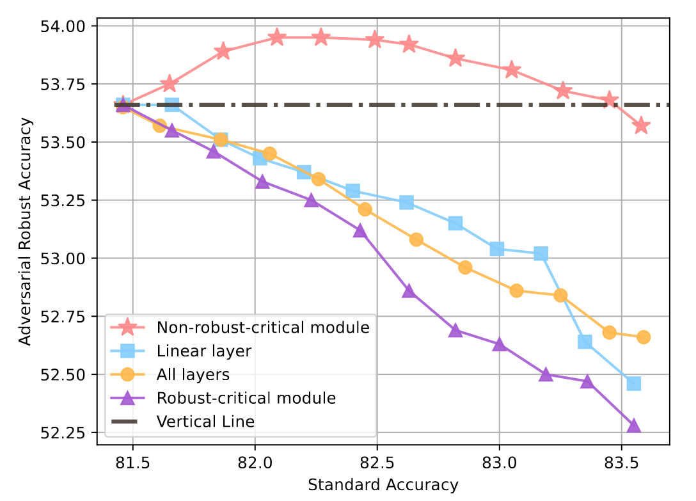
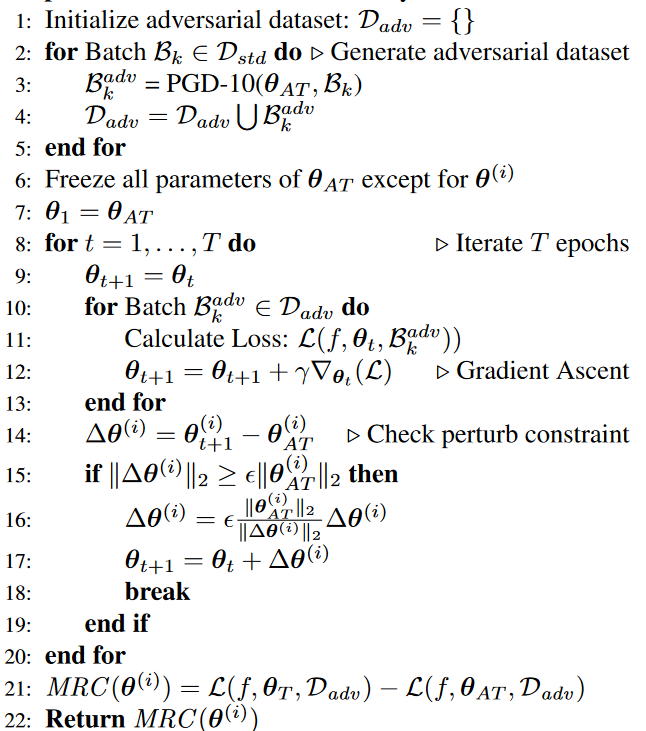
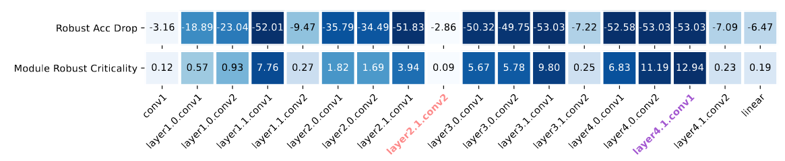
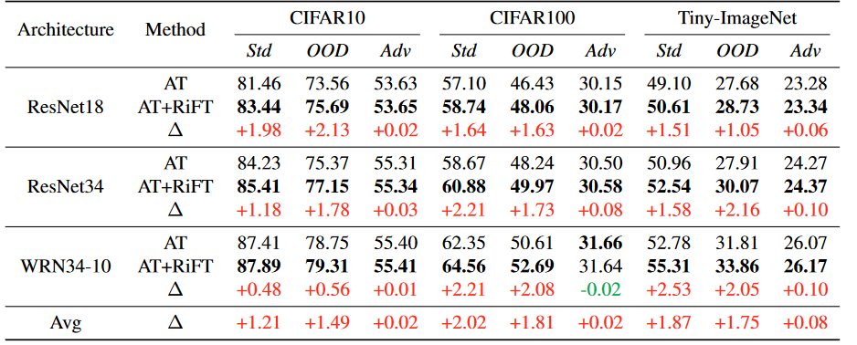
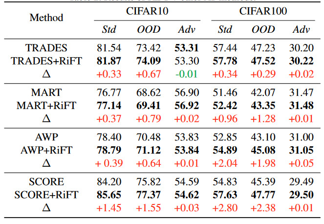
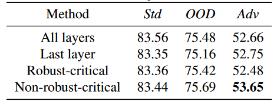
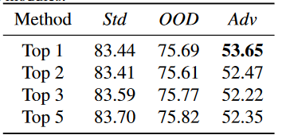

<h1 align = "center">通过鲁棒关键微调提升对抗训练的泛化性</h1>

## 摘要

​	深度神经网络易受影响，对抗性训练虽能增强鲁棒性，但会降低泛化能力。本文提出鲁棒性临界微调（RiFT），旨在增强泛化性而不影响对抗性鲁棒性。核心思想是识别非鲁棒关键模块，并对其权重进行微调。引入模块鲁棒临界性（MRC）度量，用于评估模块在权重扰动下的鲁棒性。利用MRC识别非鲁棒关键模块，微调其权重。在反向训练的权值和微调权值之间进行线性插值，得到最优的微调模型权值。在多个数据集上验证RiFT的有效性，结果表明，RiFT能显著提高泛化和分布外的鲁棒性约1.5%，同时保持甚至略微提高对抗性的鲁棒性。

## 1 引言

​	追求准确可信的人工智能系统是深度学习领域的一个基本目标。对抗性例子，通过一个很小的、人类无法察觉的噪声来干扰输入，从而导致深度神经网络做出错误的预测，对人工智能系统的安全构成了重大威胁。在防御这类对抗样本方面，已经取得了显著的实验和理论进展。在各种防御方法中，对抗训练( AT ) 已被证明是增强对抗鲁棒性的最有前途的方法之一。然而，与标准训练相比，AT严重牺牲了对分布内数据的泛化能力，并且极易受到某些分布外示例的影响，如Contrast、Bright和Fog，导致性能不理想。

<h6 align = "center">图1。在CIFAR10数据集上对ResNet18的不同模块进行微调的插值结果。Dots表示RiFT最终微调权重与初始对抗训练权重之间的不同插值点。所有的微调方法都提高了泛化能力，但只有在非鲁棒性关键模块(层2.1 . conv2 )上进行微调才能保持鲁棒性。此外，在鲁棒性关键模块( layer4.1.conv1 )上的微调会导致泛化性和鲁棒性之间的最坏权衡。在初始插值阶段，对非鲁棒性关键模块的微调将对抗鲁棒性提高了约0.3 %。</h6>

​	在对抗训练过程中，先前的技术倾向于缓和泛化性和对抗鲁棒性之间的权衡。例如，一些方法探索了重新加权实例、使用未标记数据或重新定义鲁棒损失函数。在本文中，我们采取不同的视角，通过利用对抗训练后神经网络的冗余能力来解决这种权衡。最近的研究表明，由于其复杂和不透明的特性，深度神经网络可以表现出冗余的泛化能力，其中特定的网络模块可以被删除，置换，或者重置到它们的初始值，而泛化性能只有轻微的下降。因此，很直观的想问：对抗训练的模型是否具有这样的冗余能力?如果是，如何利用它来提高泛化性和OOD鲁棒性，同时保持对抗鲁棒性?

​	基于这样的动机，我们引入了一个新的概念，称为模块鲁棒性关键度( MRC ) ，以研究对抗训练模型的冗余能力。MRC旨在量化模块参数在约束权重扰动下鲁棒性损失的最大增量。如图3所示。我们实证发现，某些模块在这种扰动下确实表现出冗余特性，导致对抗鲁棒性的下降可以忽略不计。我们将MRC值最低的模块称为非关键模块。这些发现进一步启发我们提出了一种新的微调技术，称为鲁棒性关键微调( Robust Critical Fine-Tuning，RiFT )，旨在利用非鲁棒性关键模块的冗余能力，在保持对抗鲁棒性的同时提高泛化性。RiFT包括3个步骤：(1)模块鲁棒性关键度表征，计算每个模块的MRC值，识别非鲁棒性关键模块。(2)非鲁棒关键模块的微调，通过标准算例对非鲁棒关键模块的权重进行微调，挖掘其冗余能力。(3)通过插值来缓解鲁棒性-泛化性的折衷，即在对抗训练的参数和微调的参数之间进行插值，以找到最佳的权重，在保持对抗鲁棒性的同时最大限度地提高泛化性。

​	实验结果表明，RiFT在保持甚至提高原模型对抗鲁棒性的同时，将泛化性能和OOD鲁棒性都显著提升了2 %左右。此外，我们还将RiFT结合到其他对抗训练机制中，如TRADES，MART，AT-AWP和SCORE，并表明这种结合导致了进一步的增强。更重要的是，我们的实验揭示了几个值得注意的发现。首先，我们发现在非鲁棒性关键模块上进行微调可以有效缓解对抗鲁棒性和泛化性之间的矛盾，表明这两者都可以得到改善(第5.3节)。如图1所示，在初始插值过程中，对抗鲁棒性随着泛化的增加而增加，这表明通过微调学习到的特征可以同时有利于泛化和对抗鲁棒性。这与之前的声称相矛盾，即最优标准和鲁棒分类器学习到的特征是根本不同的。其次，非鲁棒性关键模块的存在表明当前的对抗训练机制没有充分利用DNN的能力( 5.2节)。这促使未来的工作利用这种能力来设计更有效的对抗训练方法。第三，尽管先前的研究报道了在预训练模型上微调会扭曲学习到的鲁棒特征，并导致在OOD样本上的性能较差，但我们发现微调对抗训练的模型并不会导致更差的OOD性能(第5.3节)。

​	这项工作的贡献概括如下：

1. 方法新颖。我们提出了模块鲁棒性关键度的概念，并在对抗训练的模型中验证了冗余鲁棒性能力的存在。然后，我们提出了RiFT来利用这种冗余来提高AT模型的泛化能力。
1. 优越的实验结果。我们的方法将AT模型的泛化性和OOD鲁棒性都提高了2 %左右。它还可以与先前的AT方法结合，以减轻泛化性和对抗鲁棒性之间的权衡。
1. 有趣的见解。我们的实验结果揭示了泛化、对抗鲁棒性和OOD鲁棒性之间错综复杂的相互作用。我们的工作强调了利用对抗训练模型中的冗余能力来进一步提高泛化性和鲁棒性的潜力，这可能激发更高效和有效的训练方法来充分利用这种冗余。

## 2 相关工作

​	**在对抗鲁棒性和泛化性之间进行权衡** 这种权衡的存在性在对抗学习社区中得到了广泛的争论。尽管争议不断，但普遍的观点是这种权衡是内在的。理论分析表明，即使在简单的情况下，如二分类和线性回归，这种权衡也是存在的。为了解决这个矛盾，在对抗训练过程中提出了各种方法，例如实例重加权，鲁棒自训练，结合未标记数据，以及重新定义鲁棒损失函数。本文提出了一种新颖的后处理方法，利用对抗训练后模型的过剩能力来解决这种权衡。我们的RiFT可以与现有的对抗训练技术结合使用，为进一步缓解权衡提供了一种实用有效的方法。

​	**冗余拟合能力** 过度参数化的深度神经网络( DNNs )即使对随机标签也表现出惊人的拟合能力。最近的研究表明，并不是所有的模块对DNNs的泛化能力都有同等的贡献，这表明了冗余的泛化拟合能力。Veit等人发现某些块可以被删除或置换，而不会使测试性能下降太多。罗森菲尔德和Tsotsos 的研究表明，只需要训练网络参数的一小部分就可以达到相当的性能。进一步地，最近的研究确定了某些神经网络模块，称为鲁棒模块，将其参数恢复到初始值会导致可忽略不计的泛化能力下降。以往的研究提出了通过去除冗余泛化能力来降低深度神经网络的计算和存储成本，同时保持可比较的性能，如压缩和蒸馏。相比之下，我们的工作侧重于对抗训练模型的鲁棒性冗余能力，并试图挖掘这种冗余。

​	**微调方法** 在大规模数据集上进行预训练已被证明是开发高性能深度学习模型的有力手段。微调是一种广泛采用的方法，用于增强预训练模型向下游任务和领域转移的可迁移性。通常，微调方法包括微调最后一层(线性探测) 或全部层(完全微调) 。Salman等人证明了对抗训练模型的完全微调和线性探测都可以提高在下游任务上的迁移性能。然而，最近的研究表明，微调可以降低预训练的特征和在分布外( OOD )样本上的性能。为了解决这个问题，不同的微调技术被提出，如WiSE - FT 和外科手术微调，它们要么利用集成学习，要么选择性微调以获得更好的OOD性能。Kumar等人提出了两步线性探测然后全微调( LP-FT )的策略，结合了全微调和线性探测的优点。

## 3 模块稳健关键度

​	提高对抗训练模型的泛化性需要对DNN进行深入了解，然而，由于缺乏可解释性，这被证明是困难的。幸运的是，最近的研究表明，神经网络中的特定模块，称为关键模块，如果它们的参数恢复到初始值，则会显著影响模型的泛化能力。在这项工作中，我们提出了一个称为**模块鲁棒性关键度( MRC )**的度量来显式地评估每个模块的鲁棒性贡献。

### 3.1 预备知识

​	我们将$l$层DNN表示为$f(\theta)=\phi(x^{(l)};\theta^{(l)})o\ldots o\phi(x^{(1)};\theta^{(1)})$，其中$\theta^{(i)}$是第$i$层的参数,$\phi(\cdot)$表示激活函数。我们用$\theta_{AT}$和$\theta_{FT}$分别表示对抗训练和微调模型的权重。我们用$D={( x_1 , y_1),\ldots,(x_n,y_n)}$表示一个数据集，$D_{std}$表示一个标准数据集，如CIFAR10。用$\mathcal{L}$表示交叉熵损失，$∥\cdot∥_p$表示$\mathcal{l}_p$范数。

​	设$\Delta x\in\mathcal{S}$表示应用于干净输入$x$的对抗性扰动，其中$\mathcal{S}表$示输入扰动的允许范围。给定神经网络$f(\theta)$和数据集$\mathcal{D}$，对抗性训练旨在最小化鲁棒损失，如下所示：
$$
\arg \min_{\theta}\mathcal{R}(f(\theta),\mathcal{D}),其中
$$

$$
\mathcal{R(f(\theta),\mathcal{D})}=\sum_{(x,y)\in\mathcal{D}}\max_{\Delta x\in\mathcal{S}}\mathcal{L}(f(\theta,x+\Delta x),y) \tag{1}
$$

​	这里，$\mathcal{R}(f(\theta),\mathcal{D})$是寻找使交叉熵分类误差最大化的最坏情况输入扰动的鲁棒损失。

### 3.2 模块稳健关键度

​	**定义3.1** (模块稳健临界性)。给定权重扰动比例因子$\epsilon\textgreater0$和神经网络$f(\theta)$，模块$i$的鲁棒关键性定义为:
$$
MRC(f,\theta^{(i)},\mathcal{D},\epsilon)=\max_{\Delta\theta\in\mathcal{C}_{\theta}}\mathcal{R}(f(\theta+\Delta\theta),\mathcal{D})-\mathcal{R}(f(\theta),\mathcal{D})\tag{2}
$$
​	式中：$\Delta\theta=0,\ldots,0,\Delta\theta^{(i)},0,\ldots,0 $表示关于模块权重$\theta^{(i)}$的权重扰动，$\mathcal{C}_{\theta}=\Delta\theta|\|\Delta\theta\|_p\leq\epsilon\|\theta^{(i)}\|_p$，$\mathcal{R}(\cdot)$为式中定义的鲁棒损失。

​	每个模块的$MRC$值代表了它们对模型对抗鲁棒性的重要贡献。$MRC$值最小的模块被认为是冗余的，因为改变其权重对鲁棒性退化的影响可以忽略不计。我们把这个模块称为非鲁棒临界模块。直观上，$MRC$作为特定模块权重变化的上界，如定理3.1所示。由于我们不知道优化方向以及它们如何影响模型对对抗样本的鲁棒性，我们衡量了最坏情况下权重扰动对鲁棒性的影响程度，为优化权重提供了一个上界损失。进一步，模块的$MRC$刻画了鲁棒损失景观在极小值$\theta^{(i)}$附近的尖锐程度。如果$MRC$分数很高，则意味着相对于$\theta^{(i)}$的鲁棒损失景观是尖锐的，微调这个模块很可能会损害对抗鲁棒性。

​	**定理3.1** 当我们在约束$\mathcal{C}_\theta$下优化模块时，模块$i$的$MRC$值作为鲁棒损失增加的上界：
$$
\mathcal{R}(f(\boldsymbol{\theta}^*),\mathcal{D})-\mathcal{R}(f(\boldsymbol{\theta}),\mathcal{D})\leq MRC(f,\boldsymbol{\theta}^{(i)},\mathcal{D},\epsilon),
$$

$$
其中\boldsymbol{\theta}^*=\underset{\boldsymbol{\theta'},(\boldsymbol{\theta'}-\boldsymbol{\theta})\in\mathcal{C}_\theta}{\operatorname*{\arg\min}}\sum_{(\boldsymbol{x},y)\in\mathcal{D}}\mathcal{L}(f(\boldsymbol{\theta'},x),y).\tag{3}
$$

​	证明:根据$MRC$的定义，对于任意权重$(\theta'-\theta)\in\mathcal{C}_\theta$，有：
$$
\mathcal{R}(f(\boldsymbol{\theta'}),\mathcal{D})-\mathcal{R}(f(\boldsymbol{\theta}),\mathcal{D})\leq MRC(f,\boldsymbol{\theta}^{(i)},\mathcal{D},\epsilon).\tag{4}
$$
​	因此，对于优化后的权重：
$$
\boldsymbol{\theta}^*=\underset{\boldsymbol{\theta}^{\prime},(\boldsymbol{\theta}^{\prime}-\boldsymbol{\theta})\in\mathcal{C}_\theta}{\operatorname*{\arg\min}}\sum_{(\boldsymbol{x},y)\in\mathcal{D}}\mathcal{L}(f(\boldsymbol{\theta'},x),y),\tag{5}
$$
​	它满足:
$$
\mathcal{R}(f(\boldsymbol{\theta}^*),\mathcal{D})-\mathcal{R}(f(\boldsymbol{\theta}),\mathcal{D})\leq MRC(f,\boldsymbol{\theta}^{(i)},\mathcal{D},\epsilon).\tag{6}
$$
​	这样证明就结束了。

​	**备注**：$MRC$的定义在精神上与Zhang等人和Chatterji等人的工作相似。然而，$MRC$在两个方面与它们有着本质的区别。首先，$MRC$旨在捕获模块对对抗鲁棒性的影响，而Zhang等人和查特吉等人则专注于研究模块对泛化性的影响。其次，$MRC$研究了模块权重在最坏情况权重扰动下的鲁棒性特征，而Zhang et al和查特吉等人通过将模块权重卷回到它们的初始值来分析模块的性质。类似于，我们将权重扰动约束$\mathcal{C}_\theta$定义为原始参数的$\mathcal{l}_p$范数的倍数，从而保证了尺度不变性质，并允许我们比较不同层之间模块的鲁棒临界性，详细证明见附录A。

​	定理3.1为微调特定模块建立了明确的上界。该定理保证了对非鲁棒关键模块的微调不会损害模型的鲁棒性。然而，它并不能确定是否微调稳健关键模块会导致稳健精度的显著下降。

***

算法1 模块鲁棒性临界性表征

***

输入：神经网络$f$，对抗训练模型权重$\theta_{AT}$，期望模块$i$的权重$\theta^{(i)}$，标准数据集$\mathcal{D}_{std}$，权重扰动缩放因子$\epsilon$，优化迭代步数$T$，学习率$\gamma$。

输出：模块i的模块鲁棒关键性。

***

### 3.3 Relaxation of MRC

​	在等式中进行优化。需要同时找到最坏情况下的权重扰动$\Delta\theta$和最坏情况输入扰动$\Delta x$，这是耗时的。因此，我们提出在初始优化阶段固定$\Delta x$的松弛版本。具体地，我们首先计算关于$\theta_{AT}$对抗样本$\Delta x$。通过固定优化过程中的对抗样本不变，采用梯度上升法迭代优化$\Delta \theta$，使鲁棒损失最大化，从而找到最优的$\Delta\theta$。我们设置了一个权重扰动约束，并在每个优化步骤后进行检查。如果约束被违反，我们将扰动投影到约束集合上。伪代码如算法1所示。在我们的实验中，如果没有指定，我们对$\mathcal{C}_\theta$设定$\|\cdot\|_p=\|\cdot\|_2,\epsilon=0.1$，优化$\Delta\theta$的迭代步长为10。

的流程.png)

<h6 align = "center">图2 鲁棒临界微调( Robust Critical Fine-Tuning，RiFT )的流程</h6>

## 4 RiFT: Robust Critical Fine-tuning

​	在本文中，我们提出了**RiFT**，一种鲁棒的临界微调方法，它利用$MRC$来指导深度神经网络的微调，以提高泛化性和鲁棒性。令$\mathcal{P}_{adv} ( x , y)$和$\mathcal{P}_{std} ( x , y)$分别表示对抗输入和标准输入的分布。然后，将$\mathcal{P}_{adv} ( x , y)$上对抗训练的模型应用到$\mathcal{P}_{std} ( x , y)$上可以看作是一个分布偏移问题。因此，**RiFT**很自然地利用冗余能力在标准数据集上微调对抗训练的模型。

​	具体来说，RiFT包括三个步骤，如图2所示。首先，我们计算每个模块的$MRC$，并选择$MRC$得分最低的模块作为我们的非鲁棒关键模块。其次，除了我们选择的非鲁棒性关键模块外，我们冻结了对抗训练模型的参数。然后在相应的标准数据集$\mathcal{D}_{std}$上对对抗训练的模型进行微调。第三，我们对原始对抗训练模型和微调模型的权重进行线性插值，以确定在保持鲁棒性的同时最大化泛化改进的最优插值点。

​	**步骤1：模块鲁棒关键性刻画** 根据算法1，我们迭代计算每个模块$θ^{ ( i )}\in \theta _{AT}$的$MRC$值，然后选择$MRC$值最低的模块，记为$\tilde{\theta}$：
$$
\tilde{\boldsymbol{\theta}}=\boldsymbol{\theta}^{(i)}\mathrm{~where~}i=\arg\min_iMRC(f,\boldsymbol{\theta}^{(i)},\mathcal{D},\epsilon).\tag{7}
$$
​	**步骤2：对非鲁棒性关键模块进行微调** 接下来，我们冻结其余的参数，并对期望的参数$\tilde{\theta}$进行微调。我们用带动量的$SGD$方法解决了下面的优化问题。
$$
\arg\min_{\tilde{\boldsymbol{\theta}}}\sum_{(\boldsymbol{x},y)\in\mathcal{D}}\mathcal{L}(f(x,(\tilde{\boldsymbol{\theta}};\boldsymbol{\theta}\setminus\tilde{\boldsymbol{\theta}})),y)+\lambda\|\tilde{\boldsymbol{\theta}}\|_2,\tag{8}
$$
​	式中：$\lambda$为$\mathcal{l}_2$权重衰减因子。

​	**步骤3：通过插值来缓解鲁棒性-泛化性的权衡** 对于一个插值系数$\alpha$，插值权重计算为：
$$
\boldsymbol{\theta}_\alpha=(1-\alpha)\boldsymbol{\theta}_{AT}+\alpha\boldsymbol{\theta}_{FT},
\tag{9}
$$
​	其中，$θ_ {AT}$是初始对抗训练的权重，$θ_{ FT}$是由等式8得到的微调权重。由于我们的目标是在保持对抗鲁棒性的同时提高泛化性，因此选择最佳插值点作为最显著提高泛化性的点，同时对应的对抗鲁棒性不低于原始鲁棒性0.1。

​	**备注** :定理3.1建立了通过微调可以实现的鲁棒性损失可能下降的上界。预期第二步优化将强制参数位于边界$\mathcal{C}_{\theta}$内，以满足定理。然而，这里我们不采用约束优化，而是通过先无约束优化再插值来寻找最优点。这是因为( 1 )约束条件是经验给定的，可能并不总是提供保持鲁棒性的最优范围，而有可能在约束范围之外进行微调，仍能保证鲁棒性损失不大。( 2 )插值过程是一个权重集合体，它可以提高鲁棒性和泛化能力，如WiSE - FT 所述。RiFT的完整算法如附录B所示。

## 5 实验

### 5.1 实验装置

​	**数据集** 我们采用了三个流行的图像分类数据集：CIFAR10 ，CIFAR100 和TinyImageNet 。CIFAR10和CIFAR100分别包含10类和100类共60，000幅32 × 32彩色图像。Tiny - ImageNet是ImageNet的一个子集，包含200个类别，每个类别包含500张大小为64 × 64的彩色图像。我们相应地使用了3个OOD数据集来评估OOD的鲁棒性：CIFAR10 - C、CIFAR100 - C和Tiny - ImageNet - C 。这些数据集模拟了15种常见的视觉损坏，并将其分为4类：噪声、模糊、天气和数字。

​	**评价指标** 我们用每个标准数据集的测试集准确率来表示泛化能力。为了评估对抗鲁棒性，我们采用PGD - 10 的通用设置，约束条件为$\ell_{\infty}=8/255.$。我们运行了3次PGD - 10，并选择鲁棒性最差的准确率作为最终的度量标准。OOD鲁棒性通过受损数据集对应标准数据集的测试集的准确率来评估。

​	**训练细节** 我们使用ResNet18 ，ResNet34 ，WideResNet34-10 ( WRN34-10 ) 作为骨干网络。Resnet18和Resnet34分别是18层和34层的Resnet模型。WideResNet34 - 10是一个34层的WideResNet模型，加宽因子为10。类似地，我们采用PGD - 10 ，约束$\ell_{\infty}=8/255$进行对抗训练。遵循标准设置，我们用对抗样本训练了110个历元的模型。学习率从0.1开始，在历元100和105以0.1的因子衰减。我们选择测试鲁棒精度最高的权重作为我们对抗训练的模型。

​	我们使用带有动量的SGD对对抗训练的模型$θ _{AT}$进行了10个历元的微调。初始学习率设为0.001，微调5个历元后将学习率衰减1 / 10，选择测试精度最高的权值作为微调后的模型权值，记为$θ_{F T}$。然后，我们在初始对抗训练的模型权重$θ_ {AT}$和$θ _{F T}$之间进行插值，第4节中第3步选择的最佳插值点记为$θ ^* _{F T}$。然后，我们比较了$θ ^* _{F T}$和$θ _{AT}$的泛化性、对抗鲁棒性和OOD鲁棒性。

​	我们报告了三个不同种子的平均值，并省略了三个运行的标准偏差，因为它们很小( < 0.20 % )，几乎不影响结果。训练详情参见附录C。

### 5.2 $MRC$的实证分析

​	在研究RiFT的主要结果之前，我们首先对定义3.1中提出的$MRC$度量进行了实证分析，这是我们RiFT方法的基础。我们在图3中给出了ResNet18 在CIFAR - 10上的$MRC$分析，其中每一列对应一个特定模块的$MRC$值及其对应的鲁棒精度下降。

​	我们的分析表明，最坏情况权重扰动对模型鲁棒性的影响在不同的模块中有所不同。一些模块在扰动下对鲁棒性的影响很小，表明鲁棒性存在冗余能力。相反，对于其他模块，最坏情况权重扰动显示出显著的影响，导致鲁棒性大幅下降。例如，在模块层2.1 . conv2中，最坏情况下的权重扰动只会导致0.09的鲁棒损失的微小增加。然而，对于layer4.1 . conv1，最坏情况权重扰动会额外影响模型的鲁棒性损失12.94，导致鲁棒性准确率大幅下降( 53.03 % )。这些鲁棒关键和非鲁棒关键模块被验证存在于各种网络架构和数据集中，详见附录C.4 。我们还观察到，随着网络容量(例如,从WRN34 - 10到ResNet18)的减小和任务挑战性(例如,从CIFAR10到TinyImageNet)的增加，非鲁棒性关键模块的比例增加，因为复杂度较低的任务需要更少的容量，导致更多的非鲁棒性关键模块。

​	值得注意的是，稳健精度的下降与$MRC$并不直接相关。例如，layer4.0 . conv2和layer4.1 . conv1的准确率下降了53.05 %，但它们的$MRC$值不同。这种差异可以归因于错误分类样本在不同模块中的概率分布不同，从而导致相同的准确率下降，但损失不同。

### 5.3 主要结果

​	表1总结了我们研究的主要结果，从中我们有以下发现。

​	**RiFT提高了泛化能力** 首先，RiFT有效地缓解了对抗训练带来的泛化性和鲁棒性之间的矛盾。在不同的数据集和网络架构下，RiFT将对抗训练模型的泛化能力提高了约2 %。这一结果促使我们重新思考这种权衡，因为它可能是由低效的对抗训练算法造成的，而不是DNN固有的局限性。进一步地，如图1所示，在初始插值过程中，对抗鲁棒性和泛化性同时增加，表明这两个特性可以共同提高。这种趋势在不同的数据集和网络架构中被观察到；更多插图见附录C.5。这一发现挑战了Tsipras等人提出的最优标准分类器和最优鲁棒分类器的特征是根本不同的观点，因为微调过程可以同时提高鲁棒性和泛化性。

<h6 align = "center">图3 在CIFAR10上训练的ResNet18模块鲁棒性关键度( MRC )实例及其对应的鲁棒性精度下降。每一列代表一个单独的模块。第一行代表相应的鲁棒精度下降，第二行代表每个模块的MRC值。MRC值越高，模块越鲁棒-关键。有些模块对鲁棒性并不重要，表现出冗余特性，为鲁棒性做出贡献。然而，一些模块对鲁棒性至关重要。例如，layer2.1.conv2的稳健acc降幅仅为2.86 %，而layer4.1.conv1的稳健acc降幅高达53.03 %。</h6>

<h6 align = "center">表1 RiFT在不同数据集和骨干网络上的实验结果。Std表示in分布泛化的标准测试精度，OOD表示对应腐败数据集(例如, CIFAR10-C)的OOD鲁棒精度。Adv表示对抗鲁棒精度。在每一列中，我们将准确率较高的条目加粗。RiFT在保持对抗鲁棒性的同时，提高了跨架构和跨数据集的泛化性和OOD鲁棒性</h6>

​	**微调提高了OOD鲁棒性** 其次，我们的研究还调查了微调模型的分布外( OOD )鲁棒性，并观察到大约2%的改善。这一观察值得注意，因为最近的工作表明，微调预训练模型会扭曲学习到的特征，并导致OOD样本中的性能低下。此外，Yi等人证明了对抗训练增强了OOD的鲁棒性，但尚不清楚在对抗训练的模型上进行微调是否会扭曲鲁棒的特征。我们的结果表明，微调对抗训练的模型不会扭曲对抗训练学习到的鲁棒特征，反而有助于提高OOD鲁棒性。我们认为，微调对抗训练的模型可能是进一步提高OOD鲁棒性的一个有前途的途径。

### 5.4 将RiFT纳入其他AT方法

​	为了进一步验证RiFT的有效性，我们使用四种不同的对抗训练技术：TRADES，MART，AWP和SCORE在CIFAR10和CIFAR100上训练的ResNet18上进行实验，然后将我们的RiFT应用到生成的模型中。如表2所示，我们的方法兼容各种对抗训练方法，并提高了泛化性和OOD鲁棒性。

### 5.5 消融研究

​	**对不同模块进行微调** 为了评估微调非鲁棒关键模块的有效性，我们通过在不同模块上微调对抗训练的模型进行了进一步的实验。具体来说，我们使用了四种微调方法：完全微调、线性探测(最后一层的微调)、在非鲁棒性关键模块上微调和在鲁棒性关键模块上微调。实验在CIFAR - 10上使用ResNet18进行，结果如图1和表3所示。如3.2节所述，$MRC$是权重扰动的上界，表明模块在模型鲁棒性方面的重要性。在非鲁棒性关键模块上进行微调可以帮助保持对抗鲁棒性，但不能保证泛化性的提高。同样，对鲁棒关键模块的微调并不一定会损害鲁棒性。然而，我们的实验观察到，所有的微调方法都提高了泛化能力，但只有在非鲁棒性关键模块上的微调保持了对抗鲁棒性。此外，与所有层上的微调相比，在鲁棒关键模块上的微调在泛化性和鲁棒性之间表现出最差的权衡。

<h6 align = "center">表2 RIFT+其他AT方法结果。</h6>

​	**更多的非稳健关键模块，更有用吗？** 为了考察对更多的非关键模块进行微调是否能进一步提高泛化能力，我们又对排名前2、前3和前5的非稳健关键模块进行了微调。然而，从表3可以看出，泛化性和OOD鲁棒性并没有超过通过微调一个奇异的非鲁棒关键模块所获得的结果。值得注意的是，当微调多个非关键模块时，与微调所有层相比，性能恶化。值得注意的是，这并不否定$MRC$对多个模块的适用性。模块$i$的$MRC$是在其他模块参数保持不变的情况下进行评估的，这使得利用单个模块的$MRC$来识别多个模块的最坏情况扰动的影响具有挑战性。我们认为，将$MRC$的定义扩展到包含多个模块可能会解决这个问题。

<h6 align = "center">表3 对不同模块进行微调的结果。</h6>

<h6 align = "center">表4 对多个非鲁棒性关键模块进行微调的结果。</h6>

​	**插值因子$\alpha^*$上的消融**  $ \alpha ^*$的取值与微调学习率密切相关。具体来说，较大的学习率会导致大量的权重更新，这可能会使微调后的权重$\theta _{FT}$远离对抗性训练的对应物$\theta _{AT}$。我们的实证结果表明，0.001的微调学习率在大多数情况下是合适的，相应的$\alpha^*$值一般在0.6到0.9之间。

​	**与RiFT泛化增益相关的因素** 我们的结果揭示了模式和行为，为RiFT观察到的泛化收益的决定因素提供了深刻的见解。首先，RiFT的泛化增益是神经网络固有能力和分类任务固有难度的函数。具体来说，随着分类任务变得更具挑战性，每个模块的鲁棒关键性增加，这反过来又降低了RiFT的泛化增益。这种影响可以通过使用容量更大的模型来减轻。例如，在CIFAR100和TinyImageNet上进行评估时，我们观察到当我们从ResNet18切换到ResNet34和WRN34 - 10时，RiFT的泛化增益会增加。进一步地，我们观察到WRN34 - 10的RiFT在CIFAR10上的泛化增益明显较低，约为0.5 %，而在其他数据集上的泛化增益为2 %。这可能是由于对抗训练的模型与标准训练的模型之间的泛化差异最小；具体来说，WRN34 - 10的标准测试准确率约为95 %，而其对抗对手的标准测试准确率为87 %。显然，对单个模块进行微调并不能带来显著的改善。进一步研究这些模式，可以为增强深度神经网络的鲁棒性和泛化能力提供策略。

## 6 结论

​	在本文中，我们旨在利用对抗训练模型的冗余能力。我们提出的RiFT利用模块鲁棒关键性( MRC )的概念来指导微调过程，从而提高了泛化性和OOD鲁棒性。大量的实验证明了RiFT在各种网络架构和数据集上的有效性。我们的发现揭示了泛化、对抗鲁棒性和OOD鲁棒性之间错综复杂的关系。RiFT是对对抗训练模型进行微调的初步探索。我们相信，微调具有巨大的潜力，我们需要更多的理论和实证分析来推进我们对这一重要技术的理解。
