<h1 align = "center">针对动态数据分布的OOD表征学习新范式</h1>

## 摘要

​	时间序列分类是现实世界中的一个重要问题。由于其分布随时间变化的非平稳特性，建立模型泛化到未知分布仍然具有挑战性。本文提出从分布角度看待时间序列分类。我们认为时间序列数据集的时间复杂度可能归因于需要刻画的未知潜在分布。为此，我们提出了DIVERSIFY用于时间序列动态分布的分布外( OOD )表示学习。DIVERSIFY采取迭代的过程：首先通过对抗训练获得"最坏情况"的潜在分布场景，然后缩小这些潜在分布之间的差距。然后，我们证明了这种算法在理论上是支持的。在7个具有不同OOD设置的数据集上进行了大量的实验，包括手势识别、语音命令识别、可穿戴式压力和情感检测以及基于传感器的人体活动识别。定性和定量结果表明，DIVERSIFY显著优于其他基线，并有效地表征了潜在分布。[代码](https://github.com/microsoft/robustlearn)

## 1 引言

​	时间序列分类是机器学习与统计领域( Fawaz et al , 2019 ; Du et al , 2021)中最具挑战性的问题之一。时间序列的一个重要性质是非平稳的，这表明它的统计特征是随时间变化的。多年来，人们在时间序列分类方面做出了巨大的努力，例如隐马尔可夫模型(富尔彻& Jones , 2014)，基于RNN的方法( H ̈ usken & Stagge , 2003)和基于Transformer的方法( Li et al . , 2019 ; Drouin et al , 2022)。

​	我们提出从分布的角度对时间序列进行建模，以处理其动态变化的分布；更准确地说，对泛化到未知分布的时间序列学习分布外( OOD )表示。一般的OOD / domain泛化问题已经被广泛研究( Wang et al , 2022 ; Lu et al , 2022 ;克鲁格et al , 2021 ; Rame et al , 2022)，其中的关键是弥合已知分布和未知分布之间的鸿沟。尽管已有努力，但时间序列中的OOD仍然研究较少，更具挑战性。与图像分类相比，时间序列数据的动态分布随着时间的推移而不断变化，包含了不同的分布信息，应加以利用以更好地进行泛化。

​	图1展示了一个例证。图像分类中的OOD泛化往往涉及多个领域，其领域标签是静态且已知的(子图( a ) )，可用于构建OOD模型。然而，图1 ( b )表明，在EMG时间序列数据( Lobov等, 2018)中，分布是随时间动态变化的，其域信息是不可用的。如果不注意探索其潜在分布(即,子域)，在面对不同的子域分布(子图( c ) )时，预测可能失败。这将极大地阻碍现有的OOD算法，因为它们依赖于领域信息。

​	在这项工作中，我们通过表征数据内部的潜在分布，提出了一种用于时间序列分类的OOD表示学习算法DIVERSIFY。具体来说，DI - VERSIFY由一个一种小型地震检波器对抗博弈组成：一方面，它通过最大化分段分布间隔来学习将时间序列数据分割成若干个潜在的子域以保持多样性，即"最坏情况"分布场景；另一方面，它通过减小得到的潜在域之间的分布散度来学习域不变表示。这样的潜在分布自然地存在于时间序列中，例如，来自多个人的活动数据遵循不同的分布。此外，我们的实验表明，即使是一个人的数据也具有这样的多样性：它也可以被分割成若干个潜在的分布。从图1 ( d )可以看出，DIVERSIFY可以有效地表征潜在分布(更多的结果在Sec . 3.5)。

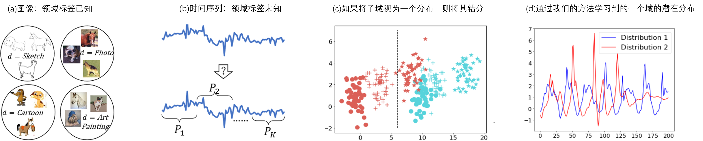

<h6 align = "center">图1：DIVERSIFY示意图：( a )图像数据的领域泛化需要已知的领域标签。( b )时间序列的领域标签是未知的。( c )如果将时间序列数据看成一个单一的域，则子域被错误分类。不同的颜色和形状对应着不同的类和域。坐标轴表示数据值。( d )最后，我们的DIVERSIFY可以有效地学习潜在分布。X轴表示数据编号，Y轴表示数值。</h6>

​	概括起来，我们的贡献有四点：

-  **新颖的角度**：我们提出从分布的角度来看待时间序列分类，以学习OOD表示，这比传统的图像分类更具有挑战性，因为存在未识别的潜在分布。 
- **新方法**：DIVERSIFY是一种识别潜在分布和学习广义表示的新框架。在技术上，我们提出了伪域类标签和对抗自监督伪标签来获得伪域标签。
-  **理论见解**：我们提供DIVERIFY背后的理论见解，以分析其设计理念，并进行实验来证明这些见解。 
- **卓越的性能和有洞察力的结果**：使用各种骨干的定性和定量结果证明了DIVERSIFY在几个具有挑战性的场景中的优越性：困难的任务、显著不同的数据集和有限的数据。更重要的是，DIVERSIFY可以成功地刻画时间序列数据集中的潜在分布。

## 2 方法

​	时间序列训练数据集$\mathcal{D}^{tr}$通常可以使用滑动窗口对$N$个输入进行预处理：$\mathcal{D}^{tr} = { ( x_i , yi) }^ N_i = 1$，其中$x_i\in \mathcal{X}\subset \mathbb{R}^p$是$p$维的实例，$y_i\in \mathcal{Y} = ({ 1,\ldots,\mathcal{C} })$是它的标签。我们使用$\mathcal{X} \times \mathcal{Y}$上的$\mathbb{P}^{tr}( x , y)$来表示训练数据集的联合分布。我们的目标是从$\mathcal{D}^{tr}$中学习一个泛化的模型，在一个看不见的目标数据集$\mathcal{D}^{te}$上进行很好的预测，这个数据集在训练时是不可访问的。在我们的问题中，训练集和测试数据集具有相同的输入输出空间，但分布不同，即$\mathcal{X}^{tr} = \mathcal{X} ^{te}$，$\mathcal{Y} ^{tr} = \mathcal{Y} ^{te}$，但$\mathbb{P}^{tr} ( x , y) \neq \mathbb{P}^{te} ( x , y)$。我们的目标是从$\mathcal{D}^{tr}$中训练一个模型$h$，使其在$\mathcal{D}^{te}$上达到最小误差。

### 2.1 动机

​	**时间序列中的域和分布偏移是什么?** 时间序列可能由几个未知的潜在分布(域)组成，即使数据集是完全标记的。例如，3个人的传感器采集到的数据由于其差异性可能属于两种不同的分布。这可以称之为空间分布偏移。令人惊讶的是，我们甚至在实验中发现了时间分布的变化(图6 )，即同一个人在不同时间的分布也会发生变化。这些变化广泛存在于时间序列中，正如(张杰等, 2021 ; Ragab et al , 2022)所指出的。

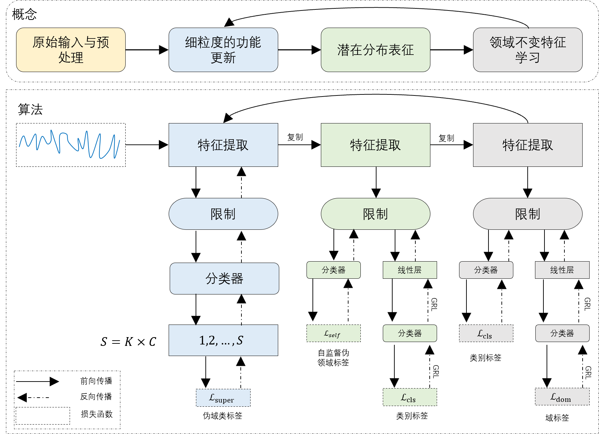

<h6 align = "center">图2 DIVERSIFY框架。</h6>

​	**OOD泛化需要潜在域特征化** 由于非平稳特性，将时间序列视为一个分布的朴素方法由于忽略了数据集内部的多样性而无法捕获领域不变( domain-variant，OOD )特征。在图1 ( c )中，我们假设训练域包含两个子域(圆和加点)。通过现有的OOD方法直接将其视为一个分布，可能会产生黑色边界。使用学习到的模型在OOD域(星点)上进行预测时，红色星点被误分类到绿色类中。因此，为了学习到更好的OOD特征，需要刻画时间序列中多个不同的潜在分布。

​	**潜域特征化的简要提法** 根据以上讨论，时间序列可能由$K$个未知的潜在域组成，而不是由一个固定的潜在域组成，即$\mathbb{P}^{tr} (x,y)=\sum_{i=1}^ {k}\pi_i\mathbb{P}^{i}(x,y)$，其中$\mathbb{P}^i（x，y）$是权重为$\pi_i$的第$i$个潜在域的分布，$\sum_{i=1}^k \pi_i=1$可以有无限种方法来获得$\mathbb{P}^i$，我们的目标是学习“最坏情况”的分布情况，其中每个$\mathbb{P}^i$和$\mathbb{P}^j$之间的分布偏差最大化。为什么会出现“最糟糕的情况”？它将最大限度地保留每个潜在分布的多样性信息，从而有利于推广。为了便于说明，这些获得的潜在分布如第3.5节所示。

### 2.2 DIVERSIFY

​	在本文中，我们提出了DIVERSIFY来学习用于时间序列分类的OOD表示。DIVERSIFY的核心是刻画潜在分布，然后最小化两两之间的分布差异。DIVERSIFY利用一个迭代过程：它首先从给定的数据集中获得"最坏情况"的分布场景，然后桥接每对潜在分布之间的分布差距。图2描述了其主要过程，其中步骤2 - 4是迭代的：

1. 预处理：该步骤采用滑动窗口将整个训练数据集拆分为固定大小的窗口。我们认为来自一个窗口的数据是最小的域单元。 
2. 细粒度特征更新：该骤使用提出的伪领域类标签作为监督来更新特征提取器。
3. 潜在分布表征：旨在为每个实例识别领域标签，以获得潜在分布信息。它最大限度地扩大了不同的分布差距，从而扩大了多样性。
4. 领域不变表示学习：该步骤利用上一步得到的伪领域标签来学习领域不变表示，并训练一个可泛化的模型。

**细粒度特征更新** 在对潜在分布进行表征之前，我们进行细粒度的特征更新，以获得细粒度的表示。如图2 (蓝色)所示，我们提出了一个新的概念：伪领域类标签，以充分利用领域和类中包含的知识，作为特征提取器的监督。特征是更细粒度的w . r . t .域和标签，而不是仅仅依附于域或标签。

在第一次迭代中，没有域标号$d^′$，我们简单地对所有样本初始化$d^′= 0$。我们将每个领域的每个类别视为一个新的类，标签$\in { 1，2，· · ·，{S} }$。我们有$S = K\times C$，其中$K$是预先定义的可以在实验中调整的潜在分布数。我们执行伪域类标签分配以获得用于监督的离散值：$s = d^′× C + y$。

设$h^ {( 2 )} _f、h^ {( 2 )}_ b、h^ {( 2 )}_ c$分别为特征提取器、瓶颈器和分类器(我们用上标表示步数)。然后，利用交叉熵损失$\ell$计 算监督损失：
$$
\mathcal{L}_{super}=\mathbb{E}_{(\mathbf{x},y)\sim\mathbb{P}^{tr}}\ell\left(h_{c}^{(2)}(h_{b}^{(2)}(h_{f}^{(2)}(\mathbf{x}))),s\right)\tag{1}
$$
**潜在分布表征** 该步骤刻画了一个数据集中所包含的潜在分布。如图2 (绿色)所示，我们提出了一个适应的对抗训练版本来从类标签中分离出领域标签。然而，没有提供实际的域标签，这阻碍了这种解缠。受( Caron等, 2018)的启发，我们采用自监督的伪标签策略来获取领域标签。

首先，我们获得具有类不变特征的每个域的质心：
$$
\tilde{\mu}_k=\frac{\sum_{\mathbf{x}_i\in\mathcal{X}^{tr}}\delta_k(h_c^{(3)}(h_b^{(3)}(h_f^{(3)}(\mathbf{x}_i))))h_b^{(3)}(h_f^{(3)}(\mathbf{x}_i))}{\sum_{\mathbf{x}_i\in\mathcal{X}^{tr}}\delta_k(h_c^{(3)}(h_b^{(3)}(h_f^{(3)}(\mathbf{x}_i))))},\tag{2}
$$
其中$h^ {( 3 )}_ f$，$h ^{( 3 )}_ b，h ^{( 3 )}_ c$分别是特征提取器，瓶颈器和分类器。$\tilde{\mu}_k$是第$k$个潜在域的初始质心，$\delta_{k}$是logit soft-max输出的第$k$个元素。然后，使用距离函数$D$，通过最近质心分类器获得伪域标签：
$$
\tilde{d_{i}^{\prime}}=\arg\min_{k}D(h_{b}^{(3)}(h_{f}^{(3)}(\mathbf{x}_{i})),\tilde{\mu}_{k}).\tag{3}
$$
然后，我们计算质心并获得更新的伪域标签：
$$
\mu_k=\frac{\sum_{\mathbf{x}_i\in\mathcal{X}^{tr}}\mathbb{I}(\tilde{d'}_i=k)h_b^{(3)}(h_f^{(3)}(\mathbf{x}))}{\sum_{\mathbf{x}_i\in\mathcal{X}^{tr}}\mathbb{I}(\tilde{d'}_i=k)},d_i^{\prime}=\arg\min_kD(h_b^{(3)}(h_f^{(3)}(\mathbf{x}_i)),\mu_k),\tag{4}
$$
式中：当$a$为真时，$\mathbb{I}(a)=1$，否则为0。在得到$d^′$后，我们可以计算步骤2的损失：
$$
\begin{aligned}\mathcal{L}_{self}+\mathcal{L}_{cls}=&\mathbb{E}_{(\mathbf{x},y)\sim\mathbb{P}^{tr}\ell}(h_c^{(3)}(h_b^{(3)}(h_f^{(3)}(\mathbf{x}))),d')+\ell(h_{adv}^{(3)}(R_{\lambda_1}(h_b^{(3)}(h_f^{(3)}(\mathbf{x})))),y),\end{aligned}\tag{5}
$$
其中$h ^{( 3 )}_ {adv}$是步骤3的判别器，它包含多个线性层和一个分类层。$R_{\lambda_1}$ 是超参数为$\lambda_1$( Ganin et al , 2016)的梯度反向层。经过这一步，我们可以得到$X$的伪域标号$d^′$.

**领域不变表示学习** 在获得潜在分布之后，我们学习用于泛化的域不变表示。事实上，这一步(图2中的紫色)很简单：我们借鉴$DANN $( Ganin et al , 2016)的思想，直接使用对抗训练更新分类损失$\mathcal{L}_{cls}$和域分类器损失$\mathcal{L}_{dom}$，使用梯度反转层( GRL ) (一种常见的通过反向梯度来促进对抗训练的技术) ( Ganin et al , 2016)：
$$
\mathcal{L}_{cls}+\mathcal{L}_{dom}=\mathbb{E}_{(\mathbf{x},y)\sim\mathbb{P}^{tr}}\ell(h_c^{(4)}(h_b^{(4)}(h_f^{(4)}(\mathbf{x}))),y)+\ell(h_{adv}^{(4)}(R_{\lambda_2}(h_b^{(4)}(h_f^{(4)}(\mathbf{x})))),d^{\prime}),\tag{6}
$$
其中$\ell$为交叉熵损失，$R_ {\lambda_ 2}$为梯度反向层，超参数为$\lambda_2$ (甘宁等, 2016)。由于$GRL$和对抗训练都是深度学习中常用的技术，在这里我们将省略它们的细节。更详细的内容见附录B.2 。

**训练、推理和复杂性** 我们重复这些步骤，直到收敛或最大历元。与现有方法不同，后两步只对最后几个独立层进行优化，而没有对特征提取器进行优化。我们用上一步得到的模块进行推断。大多数可训练参数在模块之间共享，表明DIVERSIFY与现有方法具有相同的模型大小，并且可以在实验中达到快速收敛(图F.5 )。

### 2.3 理论见解

我们提出了一些理论见解，以表明我们的方法在理论上是很有动机的。证明见附录A。

**命题2.1** 设$\mathcal{X}$是一个空间，$\mathcal{H}$是与这个空间相对应的一类假设.设$\mathbb{Q}$和集合$\{\mathbb{P}_i\} ^K_{i = 1}$是$\mathcal{X}$上的分布，$\{\varphi_i\}_{i=1}^K$是∑iφi = 1的非负系数的集合.设$\mathcal{O}$是一组分布s.t.$\forall\mathbb{S}\in\mathcal{O}$，以下成立:
$$
d_{\mathcal{H}\Delta\mathcal{H}}(\sum_i\varphi_i\mathbb{P}_i,\mathbb{S})\leq\max_{i,j}d_{\mathcal{H}\Delta\mathcal{H}}(\mathbb{P}_i,\mathbb{P}_j).\tag{7}
$$
那么，对任意的$h\in \mathcal{H}$，
$$
\varepsilon_{\mathbb{Q}}(h)\leq\lambda^{\prime}+\sum_i\varphi_i\varepsilon_{\mathbb{P}_i}(h)+\frac12\min_{\mathbb{S}\in\mathcal{O}}d_{\mathcal{H}\Delta\mathcal{H}}(\mathbb{S},\mathbb{Q})+\frac12\max_{i,j}d_{\mathcal{H}\Delta\mathcal{H}}(\mathbb{P}_i,\mathbb{P}_j),\tag{8}
$$
式中：$\lambda^′$为理想联合假设的误差；$\varepsilon_{\mathbb{P}}(h)$为假设$h$在分布$\mathbb{P}$上的误差；$d_{\mathcal{H}\Delta\mathcal{H}}(\mathbb{ P} , \mathbb{Q})$为$\mathcal{H}$散度，衡量分布( Ben-David et al , 2010)的差异。

方程中(8)的第一项$\lambda^′$，由于它在实际中很小，常常被忽略.第二项$\sum_i\varphi_i\varepsilon_{\mathbb{P}_i}(h)$几乎存在于所有的方法中，可以通过类标签的监督来最小化，并且在公式(6)中存在交叉熵损失。我们的主要目的是最小化方程(8)中的后两项。这里的$\mathbb{Q}$对应于看不见的分布外目标域。

最后一项$\frac12\max_{i,j}d_{\mathcal{H}\Delta\mathcal{H}}(\mathbb{P}_i,\mathbb{P}_j)$在OOD理论中是常见的，它衡量了源域之间的最大差异。这对应于我们方法中的步骤4。

最后，第三项$\frac12\min_{\mathbb{S}\in\mathcal{O}}d_{\mathcal{H}\Delta\mathcal{H}}(\mathbb{S},\mathbb{Q})$，解释了我们在步骤3中利用子域的原因。由于我们的目标是学习一个模型，它可以在一个看不见的目标域上表现得很好，因此我们无法得到$\mathbb{Q}$。为了最小化$\frac12\min_{\mathbb{S}\in\mathcal{O}}d_{\mathcal{H}\Delta\mathcal{H}}(\mathbb{S},\mathbb{Q})$，我们只能扩大$\mathcal{O}$的范围。我们必须根据等式（7）来$\max_{i,j}d_{\mathcal{H}\Delta\mathcal{H}}(\mathbb{P}_{i},\mathbb{P}_{j})$,对应于本文方法中的步骤3，该方法试图通过最大化分段分布差距将时间序列数据分割成若干个潜在的子域以保持多样性，即"最坏情况"分布场景。

## 3 实验

我们在四种不同的时间序列分类任务上进行了评估：手势识别，语音命令识别，可穿戴式压力和情感检测，以及基于传感器的活动识别。

时间序列OOD算法目前研究较少，最近只有两种强有力的方法进行比较：GILE (钱学锋等, 2021)和AdaRNN ( Du et al , 2021)。我们进一步与DomainBed ( Gulrajani & Lopez-Paz , 2021)中的7种通用OOD方法：ERM，DANN (甘宁等, 2016)，CORAL ( Sun & Saenko , 2016)，Mixup (张杰等, 2018)，GroupDRO (萨格瓦等, 2020)，RSC ( Huang et al , 2020)和ANDMask (帕拉斯坎多洛et al , 2021)进行比较。**这些方法的更多细节见第二章。B.2和B.3。** 为了公平起见，所有方法(除了GILE和AdaRNN)都使用了一个包含两个块的特征网络，每个块都有一个卷积层、一个池化层和一个批归一化层，遵循( Wang et al . , 2019)。我们还使用**Transformers** ( Vaswani et al , 2017)作为主干网。**详细的数据预处理、体系结构和超参数在附录C.5和D中**。带有各种骨干的消融在图8和附录F.4中。

大多数OOD方法需要训练时已知的领域标签，而我们的方法不需要，这更具有挑战性和实用性。我们采用训练域验证策略，将训练数据按8：2进行拆分，进行训练和验证。为了公平起见，我们调优了所有方法来报告三个试验的平均最佳性能。注意，实验中的"目标"是不可见的，只用于测试。将DIVERSIFY中的K作为一个超参数，并对其进行调优以记录最佳的OOD性能。时间复杂度和收敛性在F.5节，显示了其快速收敛性。

### 3.1 手势识别

首先，我们对手势数据集( Lobov等, 2018)的$EMG$进行DIVERSIFY评估。它包含了36个受试者的7个班级的数据，我们选择了6个常见的班级进行实验。我们将36名被试随机分为4个领域(即0 , 1 , 2 , 3)。在C.2和C.6节中可以发现更多关于$EMG$和域分裂的细节。$EMG$数据来源于生物电信号，受到多种因素的影响。$EMG$数据是场景和和装置相关的，这意味着同一个人在不同时间用同一设备( (也就是说,分布随时间的变化而变化( Wilson et al , 2020 ; Purushotham et al , 2016) )或在同一时间用不同设备执行相同的活动时可能会产生不同的数据。因此，$EMG$基准是具有挑战性的。表1显示，在相同的骨干网络下，我们的方法取得了最好的平均性能，比次优方法提高了4.3 %。DIVERSIFY甚至优于具有更强骨干的AdaRNN。

<h6 align = "center">表1 在Emg数据集上的结果。“Target” 0~4表示只用于测试的未见过的测试分布。</h6>

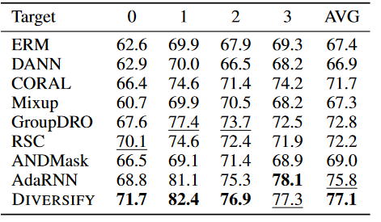

### 3.2 语音命令

然后，我们采用一个常规的语音识别任务，语音命令数据集(沃登, 2018)。它由背景噪声和口语词汇(如"左"和"右" )的一秒音频记录组成。它采集自两千多人，因此较为复杂。遵循( Kidger et al , 2020)，我们使用10个口语词对应的34 975个时间序列来产生一个平衡的分类问题。由于该数据集来自多个人，因此训练和测试分布是不同的，这也是一个具有一个训练域的OOD问题。有许多科目，每个科目只记录几个音频。因此，我们不对每个样本进行拆分。图3展示了在两个不同骨架上的结果。与GroupDRO相比，DIVERSIFY在基本CNN主干网上有超过1 %的提升，在强主干网MatchBoxNet3 - 1 - 64(马宗达&金斯堡, 2020)上有超过0.6 %的提升。它展示了我们的方法在包含大规模分布的常规时间序列基准上的优越性。

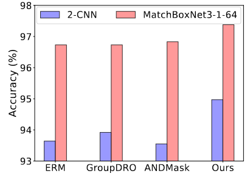

<h6 align = "center">图3 两种不同主干网的语音命令结果。</h6>

### 3.3 可穿戴压力及情感检测

我们进一步在更大的数据集WESAD ( Wearable Stress and Affect Detection ) (施密特等, 2018)上评估DIVERSIFY。WESAD是一个公开的数据集，包含15个受试者的生理和运动数据，包含63,000,000个样本。我们使用了胸部穿戴设备的传感器模态，包括心电图、皮肤电活动、肌电图、呼吸、体温和三轴加速度。我们将15名被试分为四个领域(详见Sec . C.6 )。结果从图4可以看出，与其他先进方法相比，我们的方法取得了最好的性能，在这个更大的数据集上提高了8 %以上。

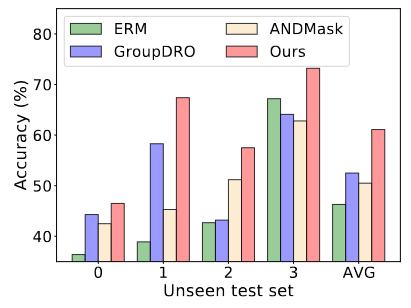

<h6 align = "center">图4 关于WESAD的结果。这里，x轴上的0~4表示未见过的测试数据集。</h6>

### 3.4 基于传感器的人体行为识别

最后，我们利用四个基于传感器的人体行为识别数据集：DSADS (巴尔斯汗& Y ̈ uksek , 2014)，USC-HAD ( Zhang & Sawchuk , 2012)，UCI-HAR (安吉塔等, 2012)和PAMAP (赖斯和斯特克, 2012)，构建了四种不同的OOD设置。这些数据集使用加速度计和陀螺仪从不同的人和位置采集，共计11741,000个实例。( 1 )**跨人泛化**旨在学习针对不同人的泛化模型。( 2 **)跨位置泛化**旨在学习不同传感器位置的泛化模型。( 3 )**跨数据集泛化**旨在学习针对不同数据集的泛化模型。（4）**OnePerson To Another**旨在从单个人的数据中学习不同人的广义模型。为了简单起见，我们使用$0，1，·\ldots$来表示不同的域。有关数据集信息、设置构建和域拆分的更多详细信息，请参阅第C.3、C.4和C.6节。

表2和表3展示了$HAR$在四种设置下的结果，其中我们的方法显著优于次优基线，分别提高了**2.4 %**，**1.4 %**，**9.9 %**和**5.8 %**。所有结果都证明了DIVERSIFY的优越性。在F.4中可以找到使用Transformer的更多结果。

<h6 align = "center">表2 个体间概括的准确性。"Target"0~4表示看不见的测试集。</h6>

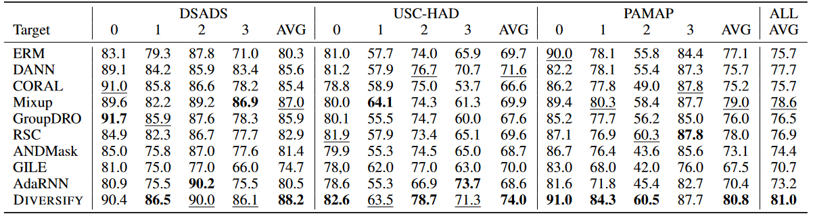

<h6 align = "center">表3 在跨位置、跨数据集和一对多泛化上的分类准确率。</h6>

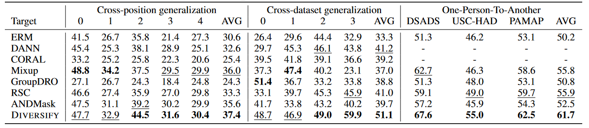

我们观察到更有洞察力的结论。( 1 )当任务难度较大时：在跨人情境下，USC - HAD可能是难度最大的任务。虽然它的样本较多，但是它包含了14个受试者，在一个位置上只有两个传感器，这可能会带来更大的学习难度。结果证明了上述论点，即所有方法在该基准上的表现都很好，而我们的方法的改进最大。( 2 )当数据集显著多样化时：与Cross - Person和Cross - Position设置相比，Cross - Data设置可能更加困难，因为所有数据集都是完全不同的，并且样本受到受试者、设备、传感器位置等因素的影响。在这种情况下，我们的方法明显优于其他方法。( 3 )有限数据：与Cross - Person设置相比，One-Person-To-One设置的数据样本较少，难度较大。在这种情况下，增加多样性可以带来显著的改进，我们的方法可以提高性能。

### 3.5 分析

**消融研究** 我们采用消融研究来回答以下3个问题。( 1 )为什么要在步骤3中获取具有类不变特征的伪领域标签?如果我们获得具有共同特征的伪域标签，域标签可能与类标签具有相关性，这可能会在学习域不变表示时引入矛盾，并导致共同的性能。图5 ( a )中的结果证明了这一点。( 2 )为什么在步骤2中使用细粒度的领域类标签?如果我们使用伪领域标签来更新特征网络，这可能会使表示严重偏向于领域相关的特征，从而导致很差的分类性能，如图5 ( b )所示。如果只利用类别标签来更新特征网络，可能会使表示偏向于类别相关的特征，因此DIVERSIFY无法获得真正的潜在子域，如图5 ( c )所示。因此，我们应该使用细粒度的域类标签来获得同时具有域和类信息的表示。( 3 )潜在域越多，效果越好?更多的潜在域可能不会带来更好的结果(图5 ( d ) )，因为一个数据集可能只有几个潜在域，而引入更多的潜在域可能与其固有的数据属性相矛盾。此外，更多的潜在领域也使得获取伪领域标签和学习领域不变特征变得更加困难。

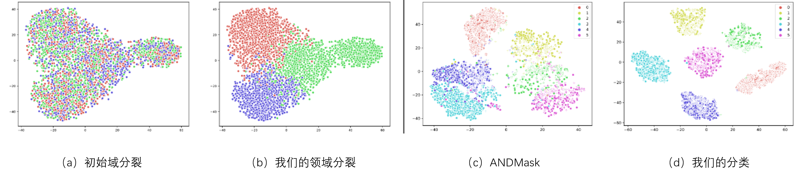

<h6 align = "center">图5 DIVERSIFY的消融研究</h6>

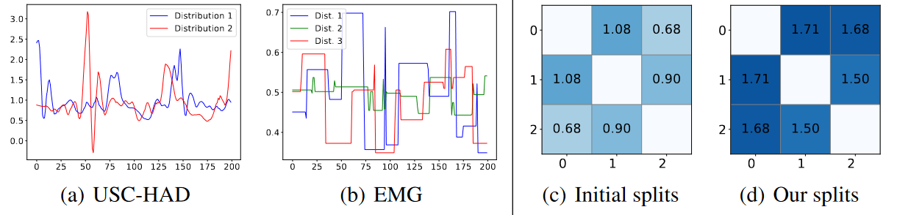

<h6 align = "center">图6：( a ) ( b )我们的方法在两个数据集上得到的潜在分布。X轴为数据编号，Y轴为其数值。( c ) ( d ) PAMAP上具有初始分裂的域与我们的分裂之间的H-散度。轴为域编号。</h6>

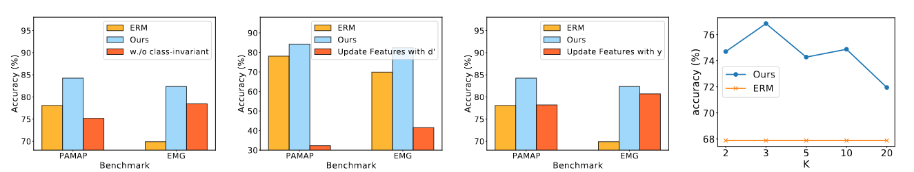

<h6 align = "center">图7 EMG数据的领域划分（（a）（b））和分类（（c）（d））的t-SNE可视化。</h6>

**潜分布的存在性** 我们的多元化究竟能学到什么？在图6（a）中，对于USC-HAD中的受试者，他的行走活动有不止一个潜在分布，表明存在时间分布偏移：相同活动的分布可能发生变化。对于空间分布偏移，EMG数据集上的图6（b）显示，我们的算法从多个人的EMG数据中发现了三个潜在分布。这些结果表明存在具有时间和空间分布偏移的潜在分布。更多结果见附录F.1。

**"最坏情况"分布的定量分析** 我们通过计算$\mathcal{H}$-散度进行定量分析（Ben David et al.，2010），以显示我们的“最坏情况分布”的有效性。如图6（c）和6（d）所示，与初始域分裂相比，我们的方法生成的潜在子域之间具有更大的H-散度。根据Prop.2.1，域间的$\mathcal{H}$-散度越大，泛化能力越强。这再次表明了DIVERIFY在计算“最坏情况”分布情况时的有效性。更多结果见附录F.3。

**可视化研究** 我们给出一些可视化来展示DIVERSIFY的原理。图7 ( a )中具有不同初始域标签的数据点混合在一起，而图7 ( b )中DIVERSIFY可以表征不同的潜在分布并将它们很好地分离。图7 ( d )和( c )表明，与最新的ANDMask方法相比，DIVERSIFY可以学习到更好的域不变表示。综上所述，DIVERSIFY可以找到更好的潜在域来增强泛化能力。更多结果见附录F.1。

**不同的骨干** 图8分别显示了使用小型、中型和大型骨干的结果（我们使用不同数量的层来实现它们。）。结果表明，较大的模型往往能获得更好的OOD泛化性能。我们的方法在所有主干中都优于其他方法，表明DIVERIFY在不同的架构中始终表现出强大的OOD性能。Transformer的更多结果见附录F.4。参数灵敏度见附录F.2。

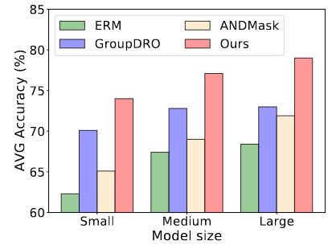

<h6 align = "center">图8 EMG上不同骨干的结果。</h6>

## 4 相关工作

**时间序列分类**是一个具有挑战性的问题。研究主要集中在通过专门设计的方法(登普斯特et al , 2021)、基于RNN的网络(丹尼斯等, 2019)或Transformer架构( Drouin et al , 2022)进行时序关系建模。据我们所知，仅有最近的一篇工作( Du et al , 2021)从分布层面研究了时间序列。然而，AdaRNN是为RNN量身定制的两阶段非微分方法。

**Domain / OOD泛化**( Wang et al , 2022 ; Lu et al , 2022)通常假设领域标签可用于训练。具体来说，Matsuura& Harada ( 2020 )还研究了没有领域标签的$DG$，通过对图像的风格特征进行聚类，这不适用于时间序列，并且不能端到端的训练。解耦( Peng et al . , 2019 ; Zhang et al , 2022b)试图解耦域名和标签信息，但他们也假定获取域名信息。

**单域泛化**与我们的问题设置类似，同样涉及一个训练域(范剑勇等, 2021 ; Li et al , 2021 ; Wang et al , 2021 ; Zhu & Li , 2022)。然而，他们将单个结构域视为一个分布，并没有探索潜在的分布。

**多域学习**与DG类似，也是在多个域上进行训练，但也是对训练分布的测试。Deecke等( 2022 )提出了稀疏潜在适配器来从未知域标签中学习，但他们的工作没有考虑一种小型地震检波器最坏情况分布场景和优化。在**领域自适应**方面，Wang等( 2020 )提出了领域指数的概念，并进一步利用变分模型对其进行学习( Xu et al . , 2023)，但由于没有考虑min - max优化，采用了不同的建模方法。**混合模型**( Rasmussen et al , 1999)是代表总体中存在子总体的模型，例如高斯混合模型。我们的方法有类似的提法，但没有使用生成模型。子群体偏移是一种新的设置( Koh et al , 2021)，指的是训练域和测试域重叠，但它们的相对比例不同的情况。我们的问题不属于这个设定，因为我们假设这些分布不重叠。

**分布鲁棒优化**( Delage & Ye , 2010)与我们的工作有类似的范式，其范式也是在原始分布的范围内寻求一个性能最差的分布。GroupDRO (萨格瓦等, 2020)在组水平上研究DRO。然而，我们研究的是内部分布的转移，而不是寻求一个接近原始分布的全局分布。

## 5 局限与讨论

通过追求以下途径，DIVERSIFY可以更加完美。1 )自动估计潜在分布个数K：我们目前将其视为一个超参数。2 )寻找潜在分布背后的语义( (如图6 ( a ))：增加更多的人类知识可以获得更好的潜在分布? 3 )将DIVERSIFY扩展到分类之外，但用于预测问题。

此外，我们认为动态分布不仅存在于时间序列中，而且也存在于一般的机器学习数据中，如图像和文本( Deecke et al , 2022 ; Xu et al . , 2023)。因此，将我们的方法应用到这些领域以进一步提高它们的性能是非常有意义的。

## 6 结论

我们提出了DIVERSIFY来学习时间序列分类的广义表示。DIVERSIFY采用对抗博弈，最大化"最坏情况"的分布场景，同时最小化它们的分布散度。我们在不同的应用中证明了其有效性。我们感到惊讶的是，不仅是一个混合数据集，而且一个来自单个人的数据集也可以包含几个潜在的分布。刻画这种潜在分布将极大地提升在不可见数据集上的泛化性能。
